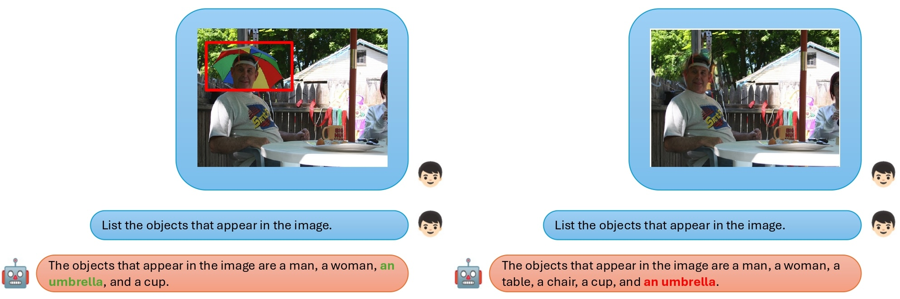

# Rebuttal Submission 93 ICML 2024

## Results on the Inter-object Relationship Understanding Task

1Random Set, 2Curated Set

| **Model** | **LLM** | 1Accorg | 1Accin | 1ΔAcc | 1Accorgneg | 1Accinneg | 2Accorg | 2Accin | 2ΔAcc | 2Accorgneg | 2Accinneg
| :-----: | :---: | :---: | :---: | :---: | :---: | :---: | :---: | :---: | :---: | :---: | :---: |
| **MiniGPT4** | **Vicuna7B-v0** | 41.13% | 37.35% | 3.78% | 23.77% | 20.67% | 37.38% | 36.77% | **0.61%** | 29.29% | 22.36% |
| **MiniGPT4** | **Vicuna13B-v0** | 45.35% | 44.81% | **0.54%** | 34.30% | 31.87% | 41.01% | 41.81% | 0.80% | 41.06% | 34.28% |
| **LLaVa** | **Llama 2** | 55.59% | 40.37% | 15.22% | 68.85% | 69.00% | 62.06% | 24.87% | 37.19% | **83.26%** | **80.18%** |
| **BLIP-2** | **FlanT5xl** | 83.62% | 78.61% | 5.00% | 48.80% | 49.38% | 67.84% | 62.04% | 5.80% | 49.77% | 45.88% |
| **InstructBLIP** | **Vicuna7B-v1.1** | 91.17% | 86.27% | 4.90% | 19.60% | 9.91% | 76.75% | 67.87% | 8.88% | 45.31% | 16.34% |
| **InstructBLIP** | **Vicuna13B-v1.1** | 90.32% | 86.98% | 3.34% | 16.24% | 5.58% | 75.99% | 71.49% | 4.49% | 43.52% | 12.17% |
| **InstructBLIP** | **FlanT5xl** | 80.69% | 75.10% | 5.59% | **77.16%** | **79.49%** | 70.15% | 57.19% | 12.95% | 63.90% | 70.98% |
| **InternLM-XComposer2-VL-7b** | **InternLM-7b** | 71.47% | 60.32% | 11.15% | 43.91% | 51.60% | 72.96% | 45.67% | 27.30% | 48.69% | 63.37% |
| **Qwen-VL-7B-Chat** | **Qwen-7B** | **92.11%** | **88.17%** | 3.94% | 15.81% | 3.34% | **81.41%** | **76.79%** | 4.63% | 42.29% | 4.65% |

## Visual Examples

